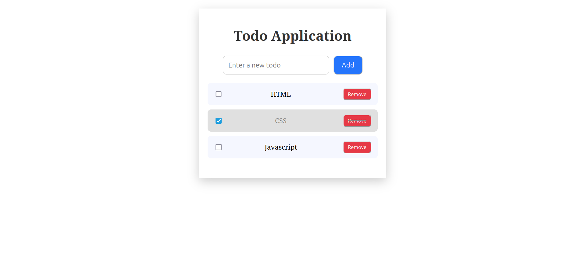

# Interactive To-Do List Application

# Objective

- Create a simple to-do list app where users can add new
tasks, mark them as complete, and remove them.

# Requirements

- Use DOM manipulation to create, update, and delete list items.
- Attach event listeners for adding tasks and toggling their
completion status.

# Output

